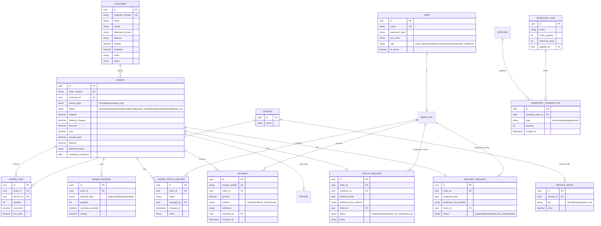

# EDCMS — Database Design

Status: Phase 0 draft ERD. Field lists are illustrative of intent, not a
final migration spec — exact columns/types are finalized when each module is
implemented, against the rules in `docs/requirements/BUSINESS-RULES.md`.

## Entity list

```
users (role is a fixed enum column, not a separate roles/permissions table - see ARCHITECTURE.md)
customers, employees
services, service_prices
orders, order_items, order_status_history
payments, invoices, receipts
pickup_requests, delivery_requests
inventory_items, inventory_transactions, suppliers
order_materials
notifications
audit_logs
settings
```

## ERD



## Key design decisions

- **Order is the central entity.** Items, materials, payments, invoice,
  pickup, delivery, and status history all hang off `order_id`.
- **`service_type` is separate from `status`.** Express/same-day is a
  priority attribute on the order, never a workflow status value — see
  BUSINESS-RULES.md.
- **Status history is append-only.** `order_status_history` is a log, not a
  mutable field — every transition is a new row with `changed_by`.
- **Payments are a ledger, not a single field.** `amount_paid`/`balance` on
  `orders` are derived from summing `payments`, kept in sync by the
  application layer (or a DB trigger/computed view), never edited directly.
- **Inventory transactions are immutable.** Stock level is derived from the
  transaction ledger; a `usage` transaction that would drive quantity below
  zero must be rejected at the service layer.
- **Materials are line items**, not a boolean flag, so they can be priced
  and reported on individually (see BUSINESS-RULES.md #4).
- Foreign keys enforce referential integrity; no soft "just trust the
  frontend" relationships.
- **`role` is a fixed enum on `users`, not a roles/permissions table.** The
  six roles are set in `docs/requirements/REQUIREMENTS.md` and don't need
  dynamic management yet; revisit only if that becomes a real requirement.

## Open items

Exact column types/precision, indexes, and constraints are finalized per
module during Phase 1 implementation and recorded via TypeORM migrations —
this document is the shape, not the migration source of truth.
